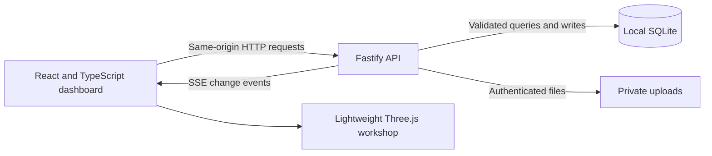

# Tobor Workspace

A fullstack operating dashboard for the Tobor service described in [Tobor_Product_and_Factory_Plan.pdf](./Tobor_Product_and_Factory_Plan.pdf): assess a request, agree a quote and design, track work, record quality checks, and make verified parts easier to reorder.

The application uses **React + TypeScript, Vite 7, Fastify 5, Node 24 and SQLite**, with a lightweight Three.js workshop visualization. It is a local pilot for one shared workspace with an administrator account. [The Tobor guide](./docs/TOBOR_GUIDE.md) explains the business, the PDF's assumptions, the engineering bottleneck and the next improvements.

On the workshop Wi-Fi, open **http://172.16.17.177:3001**. The Raspberry Pi deployment has its own application folder, Node runtime, database, service and port. See [the deployment guide](./deploy/README.md) for updates, backups and service operations. Completed changes are committed and pushed to [the Tobor repository](https://github.com/roboattis-bot/Tobor); accounts, databases, uploads and deployment archives remain private.

## Run on Windows

Use Node.js 24 or later; this project was developed with Node 24.18. Open PowerShell in this folder:

```powershell
npm.cmd install
npm.cmd run dev
```

Open **http://127.0.0.1:5173** in your browser. You can also use http://localhost:5173 if `localhost` resolves to the local IPv4 interface. The development command starts the API on port 3001 and Vite on port 5173. Vite forwards `/api` requests to the backend so the browser uses a single origin.

On first use, create the administrator account in the setup screen. There is **no default password**. Later visits show the login screen, and the account and working records persist in SQLite. Keep the initial setup local until your account exists.

To serve the built application:

```powershell
npm.cmd run build
npm.cmd start
```

Open **http://127.0.0.1:3001** or http://localhost:3001. Fastify serves the frontend and API together. The current start script uses `tsx`, so keep the project's development dependencies installed on this deployment. Stop the development servers with `Ctrl+C` before starting another backend on the same port.

## Your first workflow

1. Sign in and review the labeled demonstration data. It is sample workshop activity, not live customer orders or printer telemetry.
2. Choose **Make a part**, **Replace a part**, or **Repair a device** on Home. The new-request form asks three short groups of questions: your request, the item, then timing and quantity. Unknown material or dimensions can be reviewed by the team. Attach supporting photos or documents after saving.
3. Record assessment, route and the next owner. Use a blocked reason when information, approval or a spare is missing.
4. Prepare an itemized quote and record the approved commercial and design state before production.
5. Move work through production and quality. Enter actual results for the required quality checks before release.
6. Find verified work in the part library and create a repeat request when the use and interfaces are unchanged.

The sidebar provides **Home, Requests, Prices & approvals, Make & repair, Final checks, Saved parts, Reports, and Settings**. Home explains the five stages of a job, offers service shortcuts, and shows the next action for actual saved requests. Request cards and details explain what needs to happen next. Reports keep the detailed planning figures together; CSV export supports offline review.

The original Tobor name and logo are preserved. Larger text, wrapping labels, responsive cards, and a scrollable form with a stationary action bar keep the interface readable on phones and desktop screens. The shared service and workflow definitions live in `src/workflow.ts`; the underlying API status identifiers and approval rules are unchanged.

Procedural Three.js models include a printer, robot arm, gear, bracket, delivery box, checklist, quote, drawing, parts shelf, and combined workshop. They appear in the welcome scene, service cards, process guide, equipment cards, and saved-parts illustrations. These are illustrations, not machine readings or uploaded CAD previews.

## Configuration and stored data

Copy `.env.example` to `.env` if you want to override defaults; the server scripts load `.env`. Keep `.env` private. No cloud account or separately installed database server is required for local use.

| Variable            | Default                         | Purpose                                                                                                        |
| ------------------- | ------------------------------- | -------------------------------------------------------------------------------------------------------------- |
| `HOST`              | `127.0.0.1`                     | Bind the API to this interface.                                                                                |
| `PORT`              | `3001`                          | Backend and built-app port. The Vite proxy also needs updating if you change this in development.              |
| `DATABASE_PATH`     | `./data/tobor.sqlite`           | Persistent SQLite database. Use a local disk.                                                                  |
| `UPLOAD_DIR`        | `./data/uploads`                | Private attachment storage.                                                                                    |
| `SESSION_TTL_HOURS` | `12`                            | Session lifetime.                                                                                              |
| `APP_ORIGIN`        | Unset                           | Optional exact browser origin for requests; use the full scheme, hostname and port without a trailing slash.   |
| `SEED_DEMO`         | `true`                          | Seed example records for a fresh database. Set to `false` before the first start for an empty pilot workspace. |
| `NODE_ENV`          | Development behavior when unset | `production` enables secure cookies by default.                                                                |
| `COOKIE_SECURE`     | Derived from `NODE_ENV`         | Explicit `true` requires HTTPS; `false` supports the intentional HTTP LAN deployment.                          |
| `TEST_LOGIN_EMAIL`  | Unset                           | Existing account allowed to enter any nonempty password during testing. Leave unset for normal login.          |

Relative paths resolve from the folder where you start the server. Changing `SEED_DEMO` does not erase an existing database. Demonstration records are editable samples; changing a UI setting does not turn sample printer values into physical telemetry.

Attachments are limited to **10 MB per file** and the following extensions: `.jpg`, `.jpeg`, `.png`, `.webp`, `.pdf`, `.stl`, `.step`, `.stp`, `.3mf`, `.obj`, `.csv` and `.txt`. Files are stored outside the public frontend and downloaded through authenticated endpoints as attachments. The pilot does not scan files for malware, convert CAD, execute uploads or authorize uploaded G-code as manufacturing instructions.

Authentication uses server-side sessions and HTTP-only cookies, with passwords of at least 12 characters stored using salted scrypt hashes. The pilot's single shared workspace is intended for trusted internal operation. It does not yet provide separate customer organizations, granular operator/QC permissions, password recovery or a customer identity/signature system. Administrative approval records do not establish an independent customer sign-off. Changing a specification or attaching a new file creates a revision and revokes affected approvals and checks. Previous specifications remain available through `/api/cases/:id/revisions`.

## Architecture and latency



React renders reusable views from API records. Fastify handles authentication, validation and workflow rules. Local SQLite removes a database network hop for this pilot, while Server-Sent Events notify open dashboards when state changes. The built frontend and backend share a single origin. These choices reduce avoidable round trips and setup; response time still depends on hardware, data size, concurrency and rendering. [Fastify](https://fastify.dev/docs/latest/), [SQLite in Node 24.18](https://nodejs.org/download/release/v24.18.0/docs/api/sqlite.html), [SSE specification](https://html.spec.whatwg.org/multipage/server-sent-events.html)

SQLite's Node API executes synchronously and is a release candidate in Node 24.18. Keep database work short and indexed. WAL supports concurrent readers and one writer on a local filesystem; it is not suitable for sharing this database file across machines. Introduce PostgreSQL for multiple backend instances or sustained concurrent writes, and put CAD/conversion work in isolated asynchronous workers. [SQLite concurrency](https://www.sqlite.org/wal.html)

The PDF proposes PostgreSQL and NestJS or the team's established backend stack. Fastify and local SQLite are a deliberate simplification for a runnable single-server pilot. They preserve a relational model and an API boundary that can be extended when the operation needs it. Vite 7 remains a supported line when using its current 7.3 release; the lockfile records the installed versions. [Vite support policy](https://vite.dev/releases)

All 3D views share one lazy-loaded WebGL renderer and reusable geometry/materials. Only visible views render, at a maximum of 25 frames per second with a capped pixel ratio. The welcome scene responds to pointer movement and scrolling. Offscreen or hidden pages stop animating; the header's **Pause 3D** control remembers the user's preference, and operating-system reduced-motion settings also stop motion. Graphics failures leave simple icons and usable controls in place. Rendering runs in the visitor's browser, not on the Raspberry Pi.

## Verification

```powershell
npm.cmd run build
npm.cmd test
npm.cmd run test:e2e
```

The build checks TypeScript and creates the frontend bundle. Nine backend tests cover login/session behavior, scoped test access and its revocation, production cookie configuration, workflow and revision gates, persistence, private attachments, exports and live events. Browser tests use installed Microsoft Edge (`channel: 'msedge'` in `playwright.config.ts`), an isolated database and port 3002. If Edge is unavailable, install it or configure Playwright's Chromium channel and install that browser. Browser accounts never populate the real workspace database.

Run `npm.cmd run benchmark` for a repeatable check against a disposable local database. On this machine (Node 24.18, Windows, Intel i5-12450HX), the sample workspace returned the complete 35,058-byte dashboard response in **6.926 ms median / 14.767 ms p95** over local HTTP. This used 10 warmups and 60 sequential authenticated requests, one concurrent client, local SQLite WAL, and 18 cases / 10 printers / 6 parts. It includes response download and excludes login hashing, browser rendering, TLS and remote network latency. It is a local baseline, not a production latency guarantee or load test.

Validation completed: production build, **9 backend tests**, **7 browser tests**, and **1 test-login browser test** pass. Browser checks cover login, mobile search, session revocation, the three-step request form, saved cases and files, all eight modules at 320/390/768/1024/1440 px widths, quote approval, quality release, reviewed reorders, shared 3D rendering, scrolling, pause persistence, reduced motion, graphics recovery, and missing-library fallbacks. Screenshots are saved in `test-results/tobor-*.png`.

For the dedicated test-login browser check, set `E2E_TEST_LOGIN_EMAIL=test-access@example.test` in the test process and run `npm.cmd run test:e2e`. This selects the separate test-login scenario on a disposable database. Unset that variable afterward to run the normal seven browser tests. `TEST_LOGIN_EMAIL` is off by default in the application; when explicitly configured, the login page and dashboard show that the designated account accepts any nonempty password. Remove the setting and restart the API to restore normal login and revoke test sessions.

## Back up and restore

The database and private upload directory are one logical workspace. Back up both, plus the deployment configuration needed to locate them. Keep backup copies outside the active data directory, restrict access and test a restore to a separate local instance.

For a simple local backup, stop **every** API process cleanly, allow database connections to close and WAL checkpointing to complete, then copy the complete data directory. Include custom database/upload paths if configured. Restart only after the copy finishes. Do not copy only `tobor.sqlite` while the application is running: committed changes may still be in its WAL file. For live backups, use SQLite's online backup API and coordinate an attachment snapshot; copying an open database file is not a backup procedure. [SQLite backup API](https://www.sqlite.org/backup.html), [WAL behavior](https://www.sqlite.org/wal.html)

Restore with all application processes stopped, using a consistent database and attachment snapshot together. Start a separate instance to check login, records and attachment downloads before relying on a restored backup. Keep the previous data until that check succeeds.

## Before a public deployment

This local pilot does not include payment processing, shipping integrations, notification delivery, robot/printer adapters, CAD processing, full tenant isolation or a production backup service. The financial workbook referenced by the PDF is also missing. Sample data and the PDF's operating model are not customer demand or profitability evidence.

For an external service, add HTTPS and a trusted proxy configuration; bind the expected `APP_ORIGIN`; create appropriate organization/role permissions and independent release controls; provide account recovery; scan and constrain uploaded files; implement monitored backups and a restore rehearsal; and reconcile real payment/shipment events. Audit the actual equipment and qualified service scope before connecting hardware. The [Tobor guide](./docs/TOBOR_GUIDE.md) orders the business and software improvements around evidence from paid jobs.

## Project map

| Location              | Purpose                                                          |
| --------------------- | ---------------------------------------------------------------- |
| `src/`                | React dashboard, forms, styling and Three.js view.               |
| `server/`             | API, authentication, SQLite persistence and local file handling. |
| `shared/types.ts`     | Shared frontend/backend data contracts.                          |
| `tests/`              | Automated checks.                                                |
| `data/`               | Local records and attachments; ignored by Git.                   |
| `docs/TOBOR_GUIDE.md` | PDF interpretation, operating model and improvements.            |

The supplied PDF remains the source for the service blueprint. No equipment procurement, external account integration or physical machine operation is performed by installing this application.
