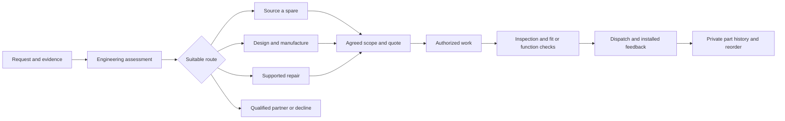

# How Tobor works, and how to improve it

Tobor sells a verified working outcome: a suitable replacement part, a custom part, a supported repair, or another batch of an approved part. The customer describes the problem. Tobor assesses it, chooses a suitable route, agrees the work, delivers it, and keeps the evidence needed to repeat it.

This guide interprets [Tobor_Product_and_Factory_Plan.pdf](../Tobor_Product_and_Factory_Plan.pdf), version 1.0 dated 6 September 2026. Page references below refer to that supplied PDF. Its prices, budgets, capacities and targets are **planning assumptions**, not measured business results or current supplier quotations. The referenced `Tobor_Factory_BOM_and_Financial_Model.xlsx` was not supplied, so its formulas, inventory deductions and item-level procurement figures have not been verified.

## The service, in practical terms

Suppose a robotics lab has a broken sensor mount. The request should include the robot model, photos of the mount in position, mating dimensions with units, quantity, intended use and what happens if the mount fails. An engineer establishes whether an original spare, a repair, a printed replacement or a specialist is the best route. A photograph alone cannot establish hidden dimensions or correct material properties.

If making a replacement is suitable, quote a defined measurement/design task first. Freeze the critical dimensions, choose a qualified material and process, approve the design revision and price, then make and inspect a first article. Check fit on the actual assembly where possible. Manufacture the agreed quantity, record inspection evidence, and dispatch with use instructions. An unchanged, successful part can later become a faster repeat order. These are the journeys described on PDF pages 2, 5-9 and 14-15.

The best route sometimes uses a purchased spare. Tobor earns from diagnosis, engineering, manufacturing, repair and repeat supply; printing every incoming request would ignore cheaper or more reliable solutions. One case owner keeps the work, customer decisions and next action together.

## What the dashboard contributes

The application is an internal operating workspace for the local pilot. It connects the case, commercial record, production stage, quality result and part history so the team can see what must happen next.

| Workspace          | Practical use                                                                                                                                |
| ------------------ | -------------------------------------------------------------------------------------------------------------------------------------------- |
| Home               | Choose what you need to make or fix, follow the five-step guide, and open requests that need attention.                                      |
| Requests           | Record the customer problem, intended use, dimensions, route, asset, owner, deadline and supporting files. Keep missing information visible. |
| Make & repair      | Follow the work queue and required approvals. The 3D equipment illustrations do not control printers or show live readings.                  |
| Prices & approvals | Separate engineering, manufacturing, testing, shipping and tax. Record the approval of a specific quote version.                             |
| Final checks       | Record expected and actual results, pass/fail decisions and required checks before release.                                                  |
| Saved parts        | Find previous parts and create repeat requests with a reference to the original work. Confirm the intended use and interfaces are unchanged. |
| Reports            | Review the recorded order economics and workload against editable assumptions. Demo results represent sample records.                        |
| Settings           | Set workspace details and operating assumptions used by the dashboard.                                                                       |

The pilot records administrative approvals inside one workspace. It does not yet prove customer identity, implement separate customer organizations, or enforce independent engineer/operator/QC roles. Full document-hash approval chains and independent second review remain future work. Staff must continue the physical inspection and release procedures from the plan.

## Why this implementation is lean

The browser uses React and TypeScript for reusable forms and dashboard views. A Fastify API applies validation, authentication and workflow rules. SQLite stores the working records on the same machine as the API, avoiding a separate database network connection for this local pilot. The built frontend and API can be served by one process and origin. The PDF suggests PostgreSQL and NestJS or the established team stack; this pilot uses a smaller deployment while preserving a relational data model and a separate API boundary. [Fastify documentation](https://fastify.dev/docs/latest/), [Node SQLite documentation](https://nodejs.org/download/release/v24.18.0/docs/api/sqlite.html)

Changes can notify open dashboards through Server-Sent Events. The browser keeps a connection open for server updates instead of repeatedly requesting unchanged information. Ordinary authenticated HTTP requests still handle user actions. This reduces avoidable polling; it does not remove network or rendering time. [SSE specification](https://html.spec.whatwg.org/multipage/server-sent-events.html)

SQLite is well suited to a small, single-server deployment with short queries. Its built-in Node API is synchronous and classed as a release candidate in Node 24.18. Long queries can hold up API work, and WAL permits only one writer at a time. Keep queries bounded, preserve indexes, and move to PostgreSQL when concurrent writers or multiple backend instances become a real requirement. [Node API constraints](https://nodejs.org/download/release/v24.18.0/docs/api/sqlite.html), [SQLite WAL](https://www.sqlite.org/wal.html)

The Three.js illustrations use one shared renderer, reusable geometry and materials, a capped render resolution, and at most 25 frames per second. Scrolling updates each model's position; views outside the screen do not keep animating. Use **Pause 3D** in the header for still illustrations. Reduced-motion settings are respected, and simple icons remain available if graphics cannot load. The models do not substitute for measured equipment telemetry or an uploaded part's actual geometry.

## Improve the business constraint first

### 1. Protect engineering capacity

The PDF's illustrative steady month uses **123.75 CAD/fixture hours out of 128 available hours**, about 96.7% utilization, leaving only **4.25 hours**. The 128-hour capacity assumes a qualified repair engineer contributes 24 hours to CAD. Without that cross-support, the mechanical lead has only 104 available hours: the example is already 19.75 hours over capacity. Repair work uses 45 of its remaining 80 hours. Pooled spare time does not automatically solve a shortage in the required skill (pages 16 and 18).

Measure actual engineering time by case and revision, including customer clarification, correction, rework and inspection. Standardize two successful part families, improve the measurement checklist and build a small approved template library. Add qualified CAD capacity when repeat backlog and lost contribution justify it. A faster printer will not remove this engineering queue.

### 2. Qualify the ten printers before buying more

The plan explicitly recommends using existing equipment first. Audit each printer's model, material capability, maintenance, repeatability and usable tools; qualify the actual printer/material/nozzle/profile combination. The suggested six production, two prototype, one long-job and one maintenance/overflow allocation is a starting hypothesis, not a universal allocation (pages 10-13).

The model's **1,497.6 good sold print-hours per month** comes from 10 printers x 26 days x 16 scheduled hours x 80% availability x 90% first-pass yield x 50% commercial utilization. Every multiplier needs evidence. Sixteen scheduled hours also assumes an appropriate staffing and monitoring arrangement. Invest first in the observed gaps: measurement, reliable production, test fixtures, engineering or customer acquisition.

### 3. Charge for engineering and track two margin views

The PDF's simple example is INR 2,500 revenue minus INR 900 incremental cash cost, giving INR 1,600 contribution. Allocating 0.6 engineering hours at INR 750/hour uses another INR 450, leaving INR 1,150 before machine/operator allocation and other overhead. These are price-testing inputs, not a prescribed price list (page 17).

Cash contribution helps assess how jobs fund monthly overhead. Economic job margin also accounts for scarce engineering and machine time. Keep these views distinct: if payroll is already included in fixed overhead, subtracting the same allocated payroll again from a cash-surplus calculation would double count it. Record actual material, purchased parts, outside work, shipping, scrap and rework before trusting a quoted margin. The pilot's simple case cost fields do not constitute accounting, tax filing or payment reconciliation.

The illustrative 160-order month has INR 715,000 revenue, INR 242,500 variable costs, INR 472,500 contribution and INR 310,000 fixed cash costs. Its INR 162,500 surplus is **before** founder draw, tax, interest, depreciation and omitted costs. A loss of INR 500 contribution on each order reduces that surplus by INR 80,000. The workbook is needed to validate and edit the complete model (pages 18-19).

### 4. Use paid evidence to decide whether to expand

Start in the city where the equipment and team already operate. The two primary segments are small factories/assembly teams and robotics/IoT labs; repair shops are a separate channel experiment. Their first offers should be narrow, supported and measurable (pages 3 and 20-21).

| Period     | Evidence proposed by the PDF                                                                    |
| ---------- | ----------------------------------------------------------------------------------------------- |
| Days 1-14  | Equipment/capability audit, 30 interviews, 15 candidate jobs and six demonstration jobs.        |
| Days 15-30 | Ten paid jobs from five unrelated buyers, with actual time, cost and fit records.               |
| Days 46-60 | Twenty-five cumulative paid jobs, three repeat buyers and two standardized job families.        |
| Days 61-90 | Forty to sixty cumulative paid jobs; decide from delivery, fit, contribution and repeat demand. |

The proposed day-90 measures are at least 85% first-fit acceptance, 90% on-time delivery, 25% qualified quote conversion and three unrelated repeat buyers. Show missing installation outcomes, cancellations, refunds and approved date changes separately. These targets are not current performance. Forty to sixty pilot jobs are learning volume, not the 160-order steady-month example.

### 5. Add automation only after the process is repeatable

The next useful software layers are organization permissions and separate release roles; immutable specification/CAD/quote approvals; complete asset custody; time and actual-cost capture; qualified machine/material records; and customer-installed fit feedback. Then connect hosted payments, shipping and notifications with retries and reconciliation. Add read-only workshop telemetry after auditing the printer interfaces (pages 7-10 and 14).

For CAD assistance, begin with three to five constrained part families and evaluate 20 measured reference jobs. Measure total engineering time, dimensional errors, invalid geometry, first fit and rework against the manual route. Native editable CAD, STEP and dimensioned drawings remain the engineering record; a mesh preview alone is insufficient. Run future geometry jobs in isolated, resource-limited workers. Human authorization remains necessary before machine work (pages 8-9).

## Where this pilot ends

This application provides a working local web workspace and database. It is not the complete factory, a public customer marketplace or a physical equipment qualification system. The PDF's full organization isolation, granular roles, customer sign-off, CAD conversion/generation, malware scanning, object-storage versioning, cloud backup automation, accounting, hosted payments, courier integration and printer/robot adapters require additional implementation and operational validation.

Before accepting real work, use the PDF's supported-service matrix and assign competent people to engineering and release. Production evidence must come from the actual part or device. The dashboard can preserve decisions and highlight missing steps; it cannot establish material suitability, mechanical fit or successful repair by itself.
